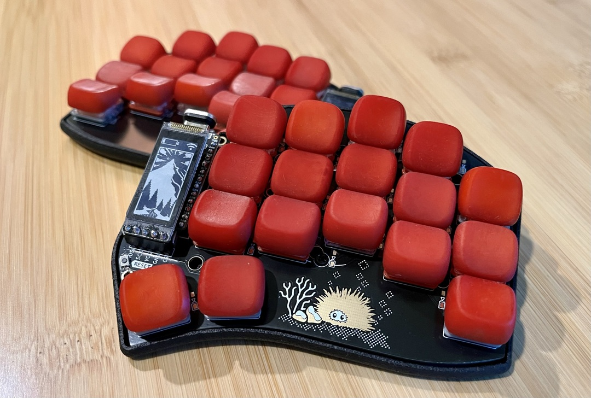
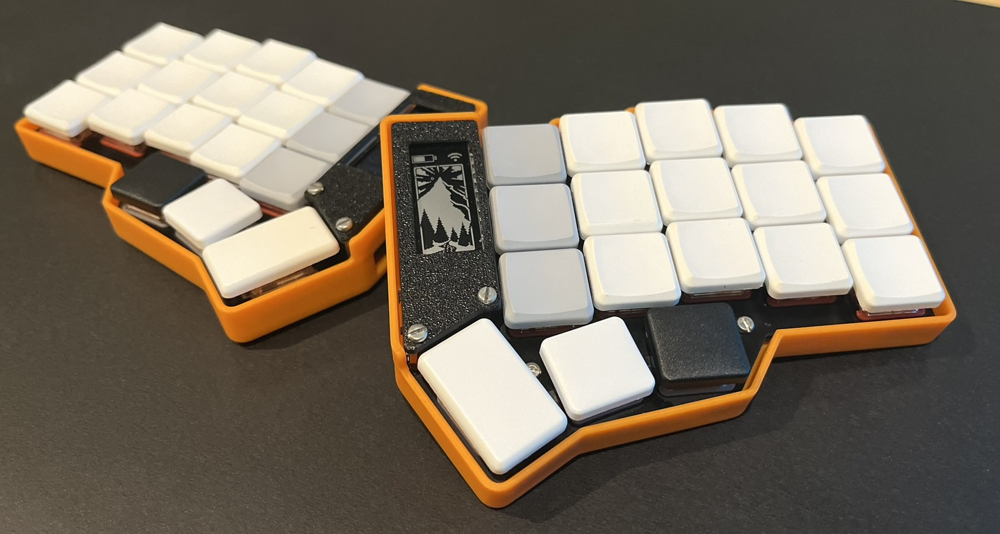
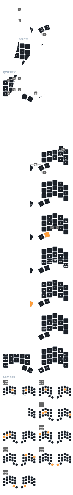
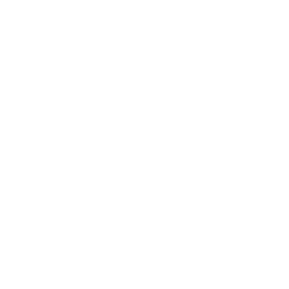
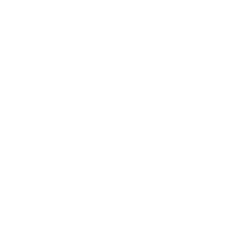
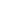
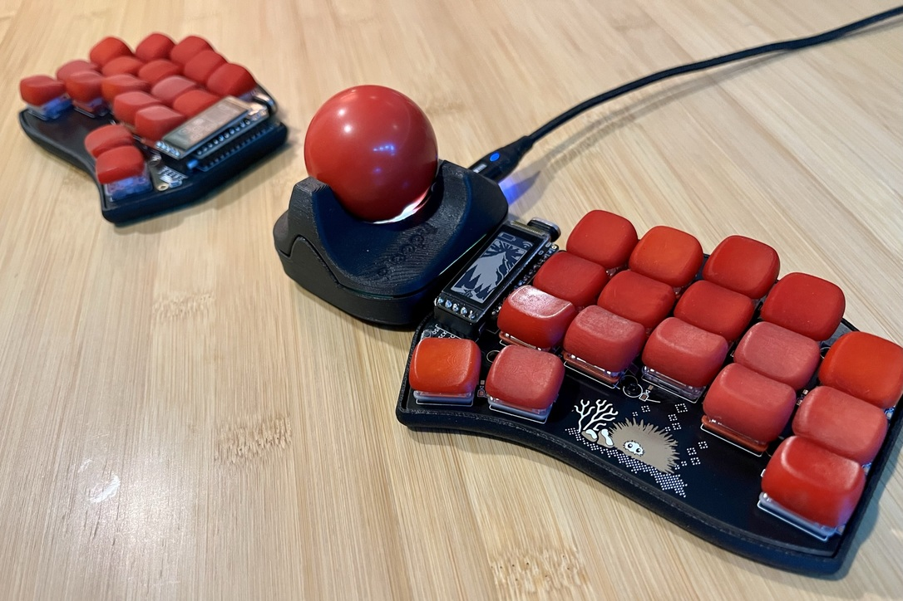

# ZMK Config

ZMK firmware configuration for Corne and Urchin keyboards, optimized for
English/French/Programming.

Since the Corne (36 keys) and Urchin (34 keys) have similar layouts, both
keyboards use the same configuration. The only exception is the combos using
thumb keys, which are in their own files ([combos_34](behaviors/combos_34.dtsi)
and [combos_36](behaviors/combos_36.dtsi)). Keyboards also have their own keymap
files, but in pratice they use the same mappings. Both firmwares are generated
simultaneously with Github Actions.

## Features

- QWERTY layout
- 5 columns with nice!nano v2 and nice!views
- Home row mods
- French characters support with a single dead key and accent layer
- Mouse keys support
- Cursor/Scroll toggle with
  [Ploopy Nano Trackball](https://github.com/ploopyco/nano-trackball)
- Easy to read files, thanks to the
  [zmk-nodefree-config](https://github.com/urob/zmk-nodefree-config) helper

## Keymap

**Legend**

| Icon                    | Label                       |
|:-----------------------:|-----------------------------|
|         | Mouse left click            |
|        | Mouse right click           |
|      | Toggle mouse scroll (trackball/scrollball) |
|             | Directional mouse scroll    |
|        | Move mouse pointer          |
|                    | Space                       |
|                | Backspace                   |
|                   | Delete                      |
|                      | Tab                         |
|                    | Return / Enter              |
|              | Printscreen                 |
|                      | Cut                         |
|                     | Copy                        |
|                    | Paste                       |
|         | Play / Pause                |
|     | Previous track              |
|         | Next track                  |
|          | Volume up                   |
|        | Volume down                 |
|          | Clear Bluetooth profile     |
|       | Previous Bluetooth profile  |
|           | Next Bluetooth profile      |
|  | Toggle Bluetooth/USB output |

For more details, head to the [urchin.keymap](config/urchin.keymap) or
[corne.keymap](config/corne.keymap) source files.

## Behaviors

The keymap uses a few behaviors in order to make everything work:

- [Combos](behaviors/combos.dtsi)
- [Hold-Tap (Home Row Mods)](behaviors/hold-tap.dtsi)
- [Macros](behaviors/macros.dtsi)
- [Mod-Morph](behaviors/mod-morph.dtsi)

## Layouts

The layout is currently based on
[Canadian Multilingual Standard (CSA)](https://commons.wikimedia.org/wiki/File:KB_Canadian_Multilingual_Standard.svg),
but it can easily be adapted to other layout by copying
[canadian-multilingual-standard.dtsi](layouts/canadian-multilingual-standard.dtsi)
and changing the macros accordingly. I've always used this layout, it's just
more convenient for me to base my layout on it. This way I don't have to change
whenever I switch keyboards.

## References

- [Corne Keyboard](https://github.com/foostan/crkbd)
- [Urchin Keyboard](https://github.com/duckyb/urchin)
- [Ploopy Nano Trackball](https://github.com/ploopyco/nano-trackball)

