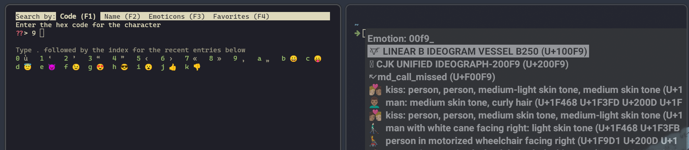

# Terminal Emulator Setup For Unicode Keybindings

If your keymap has unicode characters and you use a modern terminal emulator,
you need few additional steps in order to make it work correctly.

These instructions will work for pretty much any Linux distributions and ZMK
firmware. Make sure to use the required versions listed at the end of this
guide, as some fixes required to make it work are relatively recent.

## Why is it needed?

If you open Kitty or Wezterm and then press a key bound to an unicode character,
you'll be greeted with this kind of selector:



Every time you hit an unicode keybinding. Every single time. Let's make it work
better.

## IME

You need to install an IME (Input Method Editor), it will allow you to
commit your unicode characters directly without these annoying prompts. I
suggest to use Fcitx as it works equally good in Xorg and Wayland.

1. Install these with your package manager:

   ```txt
   fcitx5 fcitx5-gtk fcitx5-qt
   ```

1. Add these environment variable to your session. Depending on your DE/WM, that
   could be in startup config file, profile, in `/etc/environment`, etc. These
   are not all required on both X11 and Wayland, but it's harmless to include
   them all and it's a good hybrid config.

   ```env
   GLFW_IM_MODULE=ibus
   GTK_IM_MODULE=fcitx
   QT_IM_MODULE=fcitx
   SDL_IM_MODULE=fcitx5
   XIM=fcitx
   XIM_PROGRAM=fcitx
   XMODIFIERS=@im=fcitx
   ```

1. Configure your session to [execute the `fcitx5` command on startup](https://fcitx-im.org/wiki/Setup_Fcitx_5).

1. If using Wezterm, you could add this in your `wezterm.lua` to prevent
   any hiccups:

   ```lua
   use_ime = true -- Should be the default on recent releases
   xim_im_name = 'fcitx' -- In case wrong/unset XMODIFIERS env
   ```

After a reboot, unicode characters should now work correctly on X11.

In Wayland tough, GUI apps may have been fixed but most terminals will randomly
render a unshifted version of a shifted character when you type (any key, except
unicodes). For instance: "0" instead of ")", "9" instead of "(", and so on.

Luckily, there is now a way to fix it.

## Fix Fcitx

1. Edit `~/.config/fcitx5/conf/waylandim.conf` and make sure this option is set
   to false:

      ```sh
      # Forward key event instead of commiting text if it is not handled
      PreferKeyEvent=False
      ```

      > Note: This option is also available in the `fcitx5-configtool` GUI under
      > _Wayland Input Method Interface_.

1. Relaunch Fcitx with `fcitx5 --replace -d`

Everything should work fine now! 🚀

## Required Versions

| Package | X11 | Wayland |
|---------|:---:|:---------:|
| `fcitx5` | Any | [5.1.6](https://github.com/fcitx/fcitx5/releases/tag/5.1.6) |
| `kitty` | Any<sup>1</sup> | [0.34.0](https://sw.kovidgoyal.net/kitty/changelog/#id2) (not in package managers yet)<br> [Nightly build](https://github.com/kovidgoyal/kitty/releases/tag/nightly)         |
| `wezterm` | Stable [20240203-110809-5046fc22](https://github.com/wez/wezterm/releases/tag/20240203-110809-5046fc22)| Any |
| `foot` | Any | Any |
| `alacritty` | Untested | Any |

**Notes**<br>
<small><sup>1</sup> Make sure to set `GLFW_IM_MODULE=ibus`</small>

## Bonus

Hit <kbd>Ctrl</kbd> + <kbd>;</kbd> and you have a
[clipboard history](https://fcitx-im.org/wiki/Clipboard) for free.

## References

- [Setup Fcitx 5](https://fcitx-im.org/wiki/Setup_Fcitx_5)
- Wezterm [`use_ime`](https://wezfurlong.org/wezterm/config/lua/config/use_ime.html)
  and [`xim_im_name`](https://wezfurlong.org/wezterm/config/lua/config/xim_im_name.html)
- Kitty [GLFW_IM_MODULE](https://sw.kovidgoyal.net/kitty/glossary/#envvar-GLFW_IM_MODULE)
- [Fcitx Issue](https://github.com/fcitx/fcitx5/issues/893)
- [Wezterm Issue](https://github.com/wez/wezterm/issues/4615)
- [Kitty Issue](https://github.com/kovidgoyal/kitty/issues/7258) / [Pull Request](https://github.com/kovidgoyal/kitty/pull/7283)
